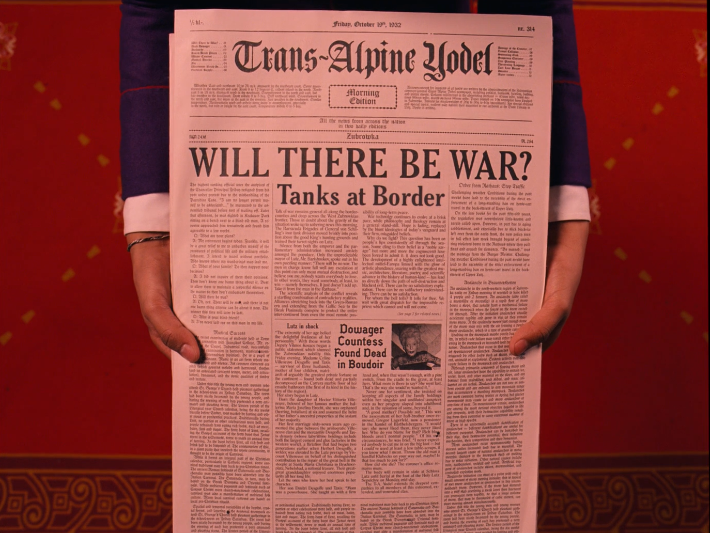
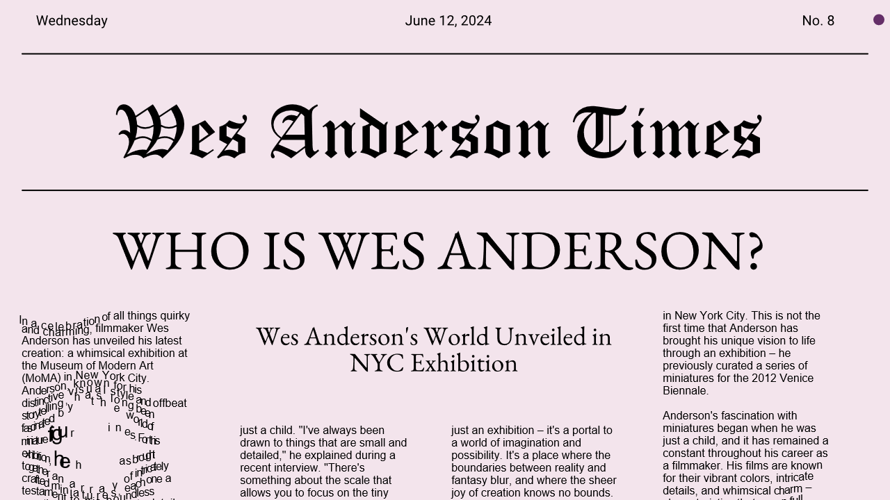

# generative_newspaper

A generative newspaper inspired by Wes Anderson's film Grand Budapest Hotel.

@AlexandraCordeiro
@leonordd
## Moodboard

    
    

## Output

    

## Utils

- [Cosmic JS](https://www.cosmicjs.com/)
- [CCapture](https://github.com/colorful-coding/coding-projects)
- [P5.js](https://p5js.org/)
- [LLM - llama](https://api.python.langchain.com/en/latest/llms/langchain_community.llms.ollama.Ollama.html)

